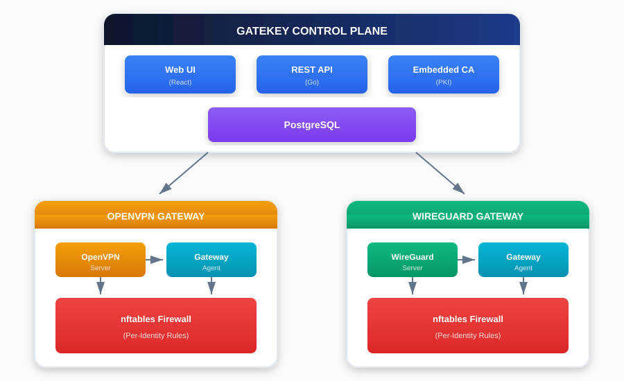

# GateKey Helm Chart

A Helm chart for deploying [GateKey](https://github.com/dye-tech/GateKey) - a modern Zero-Trust VPN control plane.

## Docker Images

GateKey images are available on Docker Hub:

- [`dyetech/gatekey-server`](https://hub.docker.com/r/dyetech/gatekey-server) - Control plane server
- [`dyetech/gatekey-web`](https://hub.docker.com/r/dyetech/gatekey-web) - Web UI
- [`dyetech/gatekey-gateway`](https://hub.docker.com/r/dyetech/gatekey-gateway) - OpenVPN gateway
- [`dyetech/gatekey-hub`](https://hub.docker.com/r/dyetech/gatekey-hub) - OpenVPN mesh hub
- [`dyetech/gatekey-mesh-gateway`](https://hub.docker.com/r/dyetech/gatekey-mesh-gateway) - OpenVPN mesh spoke
- [`dyetech/gatekey-wireguard-gateway`](https://hub.docker.com/r/dyetech/gatekey-wireguard-gateway) - WireGuard gateway
- [`dyetech/gatekey-wireguard-hub`](https://hub.docker.com/r/dyetech/gatekey-wireguard-hub) - WireGuard mesh hub
- [`dyetech/gatekey-wireguard-mesh-gateway`](https://hub.docker.com/r/dyetech/gatekey-wireguard-mesh-gateway) - WireGuard mesh spoke

All images include:
- Multi-arch support (linux/amd64, linux/arm64)
- Non-root user where applicable
- Supply chain attestations (SBOM + Provenance)

## Prerequisites

- Kubernetes 1.19+
- Helm 3.0+
- PV provisioner support in the underlying infrastructure (for persistence)

## Network Requirements

Several components require external network exposure to function. These are **hard dependencies** - without proper network configuration, these components will not work.

### Components Requiring Inbound Connections

| Component | Port | Protocol | Why |
|-----------|------|----------|-----|
| **Web UI** | 8080 | TCP | Admin dashboard access. Requires Ingress, LoadBalancer, or NodePort. |
| **Server API** | 8080 | TCP | Control plane API. Must be accessible from all VPN components (gateways, hubs, spokes). |
| **OpenVPN Gateway** | 1194 | UDP | VPN clients connect here. Requires LoadBalancer or NodePort with external IP. |
| **OpenVPN Hub** | 1194 | UDP | Mesh spokes connect here. Requires LoadBalancer or NodePort with external IP. |
| **WireGuard Gateway** | 51820 | UDP | VPN clients connect here. Requires LoadBalancer or NodePort with external IP. |
| **WireGuard Hub** | 51820 | UDP | Mesh spokes connect here. Requires LoadBalancer or NodePort with external IP. |

### Components Requiring Outbound Connections Only

| Component | Connects To | Why |
|-----------|-------------|-----|
| **OpenVPN Spoke** | Hub (UDP 1194) | Initiates connection to mesh hub |
| **WireGuard Spoke** | Hub (UDP 51820) | Initiates connection to mesh hub |

### Service Type Options

The default service type is `LoadBalancer`, which works with cloud providers (AWS, GCP, Azure). For other environments:

```yaml
# NodePort - For bare metal or when using external load balancer
openvpnGateway:
  service:
    type: NodePort
    nodePort: 31194  # Optional: specify port (30000-32767)

# ClusterIP - Only if clients are within the cluster (rare)
openvpnGateway:
  service:
    type: ClusterIP
```

### Firewall Rules

Ensure your network/cloud firewall allows:

- **Inbound UDP 1194** - OpenVPN gateways and hubs
- **Inbound UDP 51820** - WireGuard gateways and hubs
- **Inbound TCP 443/8080** - Web UI and API (depending on your ingress setup)
- **Outbound HTTPS** - VPN components need to reach the control plane API

## Installation

### Add the Helm repository

```bash
helm repo add gatekey https://dye-tech.github.io/gatekey-helm-chart
helm repo update
```

### Install the chart

```bash
helm install gatekey gatekey/gatekey -n gatekey --create-namespace
```

## Deployment Scenarios

This chart supports flexible deployment patterns. You can deploy all components together or separately across different clusters.

---

### Scenario 1: Full Deployment (All-in-One)

**Use Case:** Small to medium deployments where all components run in a single Kubernetes cluster. Ideal for development, testing, or organizations with a single data center.

**What Gets Deployed:**
- GateKey Server (control plane API)
- GateKey Web UI (admin dashboard)
- PostgreSQL database
- OpenVPN or WireGuard gateway

**Prerequisites:**
1. A Kubernetes cluster with LoadBalancer support (or use NodePort)
2. Storage provisioner for PostgreSQL persistence
3. (Optional) Ingress controller for HTTPS access to web UI

**Installation:**

```bash
helm install gatekey gatekey/gatekey -n gatekey --create-namespace \
  --set server.enabled=true \
  --set web.enabled=true \
  --set postgresql.enabled=true \
  --set openvpnGateway.enabled=true \
  --set openvpnGateway.token="your-gateway-token"
```

**With Ingress and TLS:**

```bash
helm install gatekey gatekey/gatekey -n gatekey --create-namespace \
  --set server.enabled=true \
  --set web.enabled=true \
  --set postgresql.enabled=true \
  --set server.ingress.enabled=true \
  --set server.ingress.className=nginx \
  --set server.ingress.hosts[0].host=gatekey-api.example.com \
  --set server.ingress.hosts[0].paths[0].path=/ \
  --set server.ingress.hosts[0].paths[0].pathType=Prefix \
  --set web.ingress.enabled=true \
  --set web.ingress.className=nginx \
  --set web.ingress.hosts[0].host=gatekey.example.com \
  --set web.ingress.hosts[0].paths[0].path=/ \
  --set web.ingress.hosts[0].paths[0].pathType=Prefix \
  --set openvpnGateway.enabled=true \
  --set openvpnGateway.token="your-gateway-token"
```

**Post-Installation:**
1. Get the admin password: `kubectl get secret gatekey-secrets -n gatekey -o jsonpath='{.data.admin-password}' | base64 -d`
2. Access the web UI at your ingress hostname or via port-forward: `kubectl port-forward svc/gatekey-web 8080:8080 -n gatekey`
3. Create a gateway in the admin panel and copy the token
4. Update the helm release with the gateway token

---

### Scenario 2: Control Plane Only

**Use Case:** Deploy the central management server in one location (e.g., cloud), while VPN gateways are deployed separately at edge locations, branch offices, or other cloud regions.

**What Gets Deployed:**
- GateKey Server (control plane API)
- GateKey Web UI (admin dashboard)
- PostgreSQL database

**Prerequisites:**
1. A Kubernetes cluster for the control plane
2. The control plane must be accessible from remote gateway locations (public IP or VPN)
3. TLS certificate for secure communication (recommended)

**Installation:**

```bash
helm install gatekey gatekey/gatekey -n gatekey --create-namespace \
  --set server.enabled=true \
  --set web.enabled=true \
  --set postgresql.enabled=true \
  --set config.server.corsOrigins[0]="https://gatekey.example.com"
```

**With External Database (Production):**

```bash
helm install gatekey gatekey/gatekey -n gatekey --create-namespace \
  --set server.enabled=true \
  --set web.enabled=true \
  --set postgresql.enabled=false \
  --set externalDatabase.host=your-rds-instance.amazonaws.com \
  --set externalDatabase.port=5432 \
  --set externalDatabase.database=gatekey \
  --set externalDatabase.username=gatekey \
  --set externalDatabase.existingSecret=db-credentials \
  --set externalDatabase.existingSecretKey=password
```

**Post-Installation:**
1. Configure ingress or load balancer for external access
2. Note the server URL (e.g., `https://gatekey.example.com`) - you'll need this for remote gateways
3. Create gateways/hubs/spokes in the admin panel and save the tokens

---

### Scenario 3: OpenVPN Gateway (Remote Deployment)

**Use Case:** Deploy a standalone OpenVPN gateway at a remote location (edge site, branch office, cloud region) that connects back to your central GateKey server. Users connect to this gateway to access resources at this location.

**What Gets Deployed:**
- OpenVPN Gateway only (no server, web, or database)

**Prerequisites:**
1. A running GateKey control plane (Scenario 1 or 2)
2. Gateway token from the GateKey admin panel
3. Network connectivity from the gateway to the control plane
4. LoadBalancer or NodePort for VPN client connections

**How to Get the Token:**
1. Log into the GateKey admin panel
2. Navigate to Gateways → Add Gateway
3. Select "OpenVPN" as the type
4. Configure the gateway settings (name, allowed networks, etc.)
5. Copy the generated token

**Installation:**

```bash
helm install gatekey-gateway gatekey/gatekey -n gatekey --create-namespace \
  --set server.enabled=false \
  --set web.enabled=false \
  --set postgresql.enabled=false \
  --set global.serverUrl=https://gatekey.example.com \
  --set openvpnGateway.enabled=true \
  --set openvpnGateway.token="gk_xxxxxxxxxxxxxxxx"
```

**With Custom Service Configuration:**

```bash
helm install gatekey-gateway gatekey/gatekey -n gatekey --create-namespace \
  --set server.enabled=false \
  --set web.enabled=false \
  --set postgresql.enabled=false \
  --set global.serverUrl=https://gatekey.example.com \
  --set openvpnGateway.enabled=true \
  --set openvpnGateway.token="gk_xxxxxxxxxxxxxxxx" \
  --set openvpnGateway.service.type=NodePort \
  --set openvpnGateway.service.port=1194 \
  --set openvpnGateway.service.protocol=UDP
```

**Using a Secret for the Token (Recommended for Production):**

```bash
# Create the secret first
kubectl create secret generic gateway-token \
  --from-literal=token="gk_xxxxxxxxxxxxxxxx" \
  -n gatekey

# Install with secret reference
helm install gatekey-gateway gatekey/gatekey -n gatekey \
  --set server.enabled=false \
  --set web.enabled=false \
  --set postgresql.enabled=false \
  --set global.serverUrl=https://gatekey.example.com \
  --set openvpnGateway.enabled=true \
  --set openvpnGateway.existingSecret=gateway-token \
  --set openvpnGateway.existingSecretKey=token
```

**Post-Installation:**
1. Get the gateway's external IP: `kubectl get svc -n gatekey`
2. Update DNS or inform users of the gateway address
3. The gateway will automatically register with the control plane
4. Users can download VPN configs from the web UI

---

### Scenario 4: WireGuard Gateway (Remote Deployment)

**Use Case:** Deploy a WireGuard gateway for better performance and modern protocol support. WireGuard offers faster connections, lower latency, and simpler configuration compared to OpenVPN.

**What Gets Deployed:**
- WireGuard Gateway only

**Prerequisites:**
1. A running GateKey control plane
2. Gateway token from the admin panel (select WireGuard type)
3. The Kubernetes nodes must support WireGuard (kernel module)

**Installation:**

```bash
helm install gatekey-wg-gateway gatekey/gatekey -n gatekey --create-namespace \
  --set server.enabled=false \
  --set web.enabled=false \
  --set postgresql.enabled=false \
  --set global.serverUrl=https://gatekey.example.com \
  --set wireguardGateway.enabled=true \
  --set wireguardGateway.token="gk_xxxxxxxxxxxxxxxx"
```

**With Resource Limits:**

```bash
helm install gatekey-wg-gateway gatekey/gatekey -n gatekey --create-namespace \
  --set server.enabled=false \
  --set web.enabled=false \
  --set postgresql.enabled=false \
  --set global.serverUrl=https://gatekey.example.com \
  --set wireguardGateway.enabled=true \
  --set wireguardGateway.token="gk_xxxxxxxxxxxxxxxx" \
  --set wireguardGateway.resources.requests.cpu=100m \
  --set wireguardGateway.resources.requests.memory=128Mi \
  --set wireguardGateway.resources.limits.cpu=500m \
  --set wireguardGateway.resources.limits.memory=256Mi
```

**Post-Installation:**
1. Verify the gateway is running: `kubectl get pods -n gatekey`
2. Check logs for successful registration: `kubectl logs -n gatekey -l app.kubernetes.io/component=wireguard-gateway`
3. The gateway should appear as "online" in the admin panel

---

### Scenario 5: OpenVPN Mesh Hub

**Use Case:** Deploy a central hub for site-to-site mesh networking. Branch offices (spokes) connect to this hub to communicate with each other and access shared resources. The hub acts as a routing point for inter-site traffic.

**What Gets Deployed:**
- OpenVPN Hub (mesh networking central node)

**Architecture:**
```
                    ┌─────────────┐
                    │   Hub       │
                    │ (This Node) │
                    └──────┬──────┘
           ┌───────────────┼───────────────┐
           │               │               │
      ┌────▼────┐    ┌─────▼─────┐   ┌─────▼─────┐
      │ Spoke A │    │  Spoke B  │   │  Spoke C  │
      │ (Site 1)│    │ (Site 2)  │   │ (Site 3)  │
      └─────────┘    └───────────┘   └───────────┘
```

**Prerequisites:**
1. A running GateKey control plane
2. Hub token from the admin panel (Mesh → Add Hub)
3. Static IP or DNS name for spoke connections
4. Network planning: Define the mesh subnet and site-specific subnets

**How to Get the Token:**
1. Log into the GateKey admin panel
2. Navigate to Mesh Networking → Add Hub
3. Configure hub settings (name, mesh subnet, local networks)
4. Copy the generated token

**Installation:**

```bash
helm install gatekey-hub gatekey/gatekey -n gatekey --create-namespace \
  --set server.enabled=false \
  --set web.enabled=false \
  --set postgresql.enabled=false \
  --set global.serverUrl=https://gatekey.example.com \
  --set openvpnHub.enabled=true \
  --set openvpnHub.token="gk_hub_xxxxxxxxxxxxxxxx"
```

**With Static IP (Cloud Provider):**

```bash
helm install gatekey-hub gatekey/gatekey -n gatekey --create-namespace \
  --set server.enabled=false \
  --set web.enabled=false \
  --set postgresql.enabled=false \
  --set global.serverUrl=https://gatekey.example.com \
  --set openvpnHub.enabled=true \
  --set openvpnHub.token="gk_hub_xxxxxxxxxxxxxxxx" \
  --set openvpnHub.service.annotations."service\.beta\.kubernetes\.io/aws-load-balancer-eip-allocations"=eipalloc-xxxxxxxxx
```

**Post-Installation:**
1. Get the hub's external address: `kubectl get svc gatekey-hub-openvpn-hub -n gatekey`
2. Note this address - spokes will need it to connect
3. Create spoke configurations in the admin panel for each site

---

### Scenario 6: OpenVPN Mesh Spoke

**Use Case:** Deploy a spoke node at a branch office or remote site that connects to a mesh hub. This enables site-to-site connectivity, allowing resources at this site to be accessed from other sites in the mesh.

**What Gets Deployed:**
- OpenVPN Spoke (mesh networking edge node)

**Prerequisites:**
1. A running GateKey control plane
2. A running mesh hub (Scenario 5)
3. Spoke token from the admin panel
4. Hub address and port
5. Local network CIDR that this spoke will advertise

**How to Get the Token:**
1. Log into the GateKey admin panel
2. Navigate to Mesh Networking → Your Hub → Add Spoke
3. Configure spoke settings (name, local networks to advertise)
4. Copy the generated token and note the hub address

**Installation:**

```bash
helm install gatekey-spoke gatekey/gatekey -n gatekey --create-namespace \
  --set server.enabled=false \
  --set web.enabled=false \
  --set postgresql.enabled=false \
  --set global.serverUrl=https://gatekey.example.com \
  --set openvpnSpoke.enabled=true \
  --set openvpnSpoke.token="gk_spoke_xxxxxxxxxxxxxxxx" \
  --set openvpnSpoke.hubAddress=hub.example.com \
  --set openvpnSpoke.hubPort=1194
```

**With Node Selector (Deploy to Specific Node):**

```bash
helm install gatekey-spoke gatekey/gatekey -n gatekey --create-namespace \
  --set server.enabled=false \
  --set web.enabled=false \
  --set postgresql.enabled=false \
  --set global.serverUrl=https://gatekey.example.com \
  --set openvpnSpoke.enabled=true \
  --set openvpnSpoke.token="gk_spoke_xxxxxxxxxxxxxxxx" \
  --set openvpnSpoke.hubAddress=hub.example.com \
  --set openvpnSpoke.hubPort=1194 \
  --set openvpnSpoke.nodeSelector."kubernetes\.io/hostname"=edge-node-1
```

**Post-Installation:**
1. Check spoke connection status: `kubectl logs -n gatekey -l app.kubernetes.io/component=openvpn-spoke`
2. Verify in admin panel that the spoke shows as "connected"
3. Test connectivity to other sites in the mesh
4. Routes should be automatically propagated to other spokes

---

### Scenario 7: WireGuard Mesh Hub

**Use Case:** Deploy a WireGuard-based mesh hub for better performance in site-to-site networking. WireGuard's efficiency makes it ideal for high-throughput mesh networks.

**What Gets Deployed:**
- WireGuard Hub (mesh networking central node)

**Prerequisites:**
1. A running GateKey control plane
2. Hub token from the admin panel (Mesh → Add Hub, select WireGuard)
3. Kubernetes nodes with WireGuard kernel support
4. Static IP or DNS name for spoke connections

**Installation:**

```bash
helm install gatekey-wg-hub gatekey/gatekey -n gatekey --create-namespace \
  --set server.enabled=false \
  --set web.enabled=false \
  --set postgresql.enabled=false \
  --set global.serverUrl=https://gatekey.example.com \
  --set wireguardHub.enabled=true \
  --set wireguardHub.token="gk_hub_xxxxxxxxxxxxxxxx"
```

**With Tolerations (Run on Dedicated Nodes):**

```bash
helm install gatekey-wg-hub gatekey/gatekey -n gatekey --create-namespace \
  --set server.enabled=false \
  --set web.enabled=false \
  --set postgresql.enabled=false \
  --set global.serverUrl=https://gatekey.example.com \
  --set wireguardHub.enabled=true \
  --set wireguardHub.token="gk_hub_xxxxxxxxxxxxxxxx" \
  --set wireguardHub.tolerations[0].key=dedicated \
  --set wireguardHub.tolerations[0].value=vpn \
  --set wireguardHub.tolerations[0].effect=NoSchedule
```

**Post-Installation:**
1. Get the hub's external address for WireGuard (UDP 51820)
2. Verify hub status in the admin panel
3. Create WireGuard spoke configurations for each site

---

### Scenario 8: WireGuard Mesh Spoke

**Use Case:** Deploy a WireGuard spoke at a remote site for high-performance site-to-site connectivity. Ideal for sites with high bandwidth requirements or latency-sensitive applications.

**What Gets Deployed:**
- WireGuard Spoke (mesh networking edge node)

**Prerequisites:**
1. A running GateKey control plane
2. A running WireGuard mesh hub (Scenario 7)
3. Spoke token from the admin panel
4. Hub address and port (default: 51820)
5. WireGuard kernel support on the node

**Installation:**

```bash
helm install gatekey-wg-spoke gatekey/gatekey -n gatekey --create-namespace \
  --set server.enabled=false \
  --set web.enabled=false \
  --set postgresql.enabled=false \
  --set global.serverUrl=https://gatekey.example.com \
  --set wireguardSpoke.enabled=true \
  --set wireguardSpoke.token="gk_spoke_xxxxxxxxxxxxxxxx" \
  --set wireguardSpoke.hubAddress=wg-hub.example.com \
  --set wireguardSpoke.hubPort=51820
```

**With All Options (Production Example):**

```bash
# Create secret for token
kubectl create secret generic wg-spoke-token \
  --from-literal=token="gk_spoke_xxxxxxxxxxxxxxxx" \
  -n gatekey

# Install spoke
helm install gatekey-wg-spoke gatekey/gatekey -n gatekey \
  --set server.enabled=false \
  --set web.enabled=false \
  --set postgresql.enabled=false \
  --set global.serverUrl=https://gatekey.example.com \
  --set wireguardSpoke.enabled=true \
  --set wireguardSpoke.existingSecret=wg-spoke-token \
  --set wireguardSpoke.existingSecretKey=token \
  --set wireguardSpoke.hubAddress=wg-hub.example.com \
  --set wireguardSpoke.hubPort=51820 \
  --set wireguardSpoke.resources.requests.cpu=50m \
  --set wireguardSpoke.resources.requests.memory=64Mi \
  --set wireguardSpoke.resources.limits.cpu=200m \
  --set wireguardSpoke.resources.limits.memory=128Mi
```

**Post-Installation:**
1. Verify spoke connection: `kubectl logs -n gatekey -l app.kubernetes.io/component=wireguard-spoke`
2. Check handshake status in logs (should see successful handshake with hub)
3. Test connectivity to hub and other spokes
4. Monitor latency and throughput in the admin panel

---

### Scenario Comparison

| Scenario | Components | Use Case | Network Requirements |
|----------|------------|----------|---------------------|
| 1. Full | Server, Web, DB, Gateway | Single cluster, dev/test | LoadBalancer or Ingress |
| 2. Control Plane | Server, Web, DB | Central management | Accessible from all gateways |
| 3. OpenVPN GW | Gateway only | Remote VPN access | UDP 1194 inbound |
| 4. WireGuard GW | Gateway only | High-performance VPN | UDP 51820 inbound |
| 5. OpenVPN Hub | Hub only | Mesh central point | UDP 1194 inbound |
| 6. OpenVPN Spoke | Spoke only | Mesh edge site | Outbound to hub |
| 7. WireGuard Hub | Hub only | High-perf mesh | UDP 51820 inbound |
| 8. WireGuard Spoke | Spoke only | High-perf edge | Outbound to hub |

## Token Authentication

VPN components (gateways, hubs, spokes) authenticate with the GateKey server using tokens. Tokens are generated in the GateKey admin panel when you create a gateway or mesh node.

### Setting Token Directly

```bash
--set openvpnGateway.token="gk_abc123..."
```

### Using an Existing Secret

For production deployments, store the token in a Kubernetes secret:

```bash
# Create the secret
kubectl create secret generic gateway-credentials \
  --from-literal=token="gk_abc123..." \
  -n gatekey

# Reference it in the Helm install
helm install gatekey-gateway gatekey/gatekey -n gatekey \
  --set openvpnGateway.enabled=true \
  --set openvpnGateway.existingSecret=gateway-credentials \
  --set openvpnGateway.existingSecretKey=token \
  --set global.serverUrl=https://gatekey.example.com
```

## Configuration Reference

### Global Settings

| Parameter | Description | Default |
|-----------|-------------|---------|
| `global.imageRegistry` | Global Docker image registry | `""` |
| `global.imagePullSecrets` | Global Docker registry secrets | `[]` |
| `global.storageClass` | Global storage class | `""` |
| `global.serverUrl` | GateKey server URL for remote VPN components | `""` (uses in-cluster service) |

### Server Component

| Parameter | Description | Default |
|-----------|-------------|---------|
| `server.enabled` | Enable GateKey server | `true` |
| `server.replicaCount` | Number of server replicas | `1` |
| `server.image.repository` | Server image repository | `dyetech/gatekey-server` |
| `server.image.tag` | Server image tag | `1.5.1` |

### Web UI Component

| Parameter | Description | Default |
|-----------|-------------|---------|
| `web.enabled` | Enable GateKey web UI | `true` |
| `web.replicaCount` | Number of web UI replicas | `2` |
| `web.image.repository` | Web image repository | `dyetech/gatekey-web` |
| `web.image.tag` | Web image tag | `1.5.1` |

### OpenVPN Gateway

| Parameter | Description | Default |
|-----------|-------------|---------|
| `openvpnGateway.enabled` | Enable OpenVPN gateway | `false` |
| `openvpnGateway.image.repository` | Gateway image | `dyetech/gatekey-gateway` |
| `openvpnGateway.token` | Authentication token | `""` |
| `openvpnGateway.existingSecret` | Use existing secret for token | `""` |
| `openvpnGateway.existingSecretKey` | Key in existing secret | `gateway-token` |
| `openvpnGateway.service.type` | Service type | `LoadBalancer` |
| `openvpnGateway.service.port` | Service port | `1194` |
| `openvpnGateway.service.protocol` | Protocol (UDP/TCP) | `UDP` |

### OpenVPN Hub

| Parameter | Description | Default |
|-----------|-------------|---------|
| `openvpnHub.enabled` | Enable OpenVPN hub | `false` |
| `openvpnHub.image.repository` | Hub image | `dyetech/gatekey-hub` |
| `openvpnHub.token` | Authentication token | `""` |
| `openvpnHub.existingSecret` | Use existing secret for token | `""` |
| `openvpnHub.service.type` | Service type | `LoadBalancer` |
| `openvpnHub.service.port` | Service port | `1194` |

### OpenVPN Spoke

| Parameter | Description | Default |
|-----------|-------------|---------|
| `openvpnSpoke.enabled` | Enable OpenVPN spoke | `false` |
| `openvpnSpoke.image.repository` | Spoke image | `dyetech/gatekey-mesh-gateway` |
| `openvpnSpoke.token` | Authentication token | `""` |
| `openvpnSpoke.existingSecret` | Use existing secret for token | `""` |
| `openvpnSpoke.hubAddress` | Hub address to connect to | `""` |
| `openvpnSpoke.hubPort` | Hub port | `1194` |

### WireGuard Gateway

| Parameter | Description | Default |
|-----------|-------------|---------|
| `wireguardGateway.enabled` | Enable WireGuard gateway | `false` |
| `wireguardGateway.image.repository` | Gateway image | `dyetech/gatekey-wireguard-gateway` |
| `wireguardGateway.token` | Authentication token | `""` |
| `wireguardGateway.existingSecret` | Use existing secret for token | `""` |
| `wireguardGateway.service.type` | Service type | `LoadBalancer` |
| `wireguardGateway.service.port` | Service port | `51820` |

### WireGuard Hub

| Parameter | Description | Default |
|-----------|-------------|---------|
| `wireguardHub.enabled` | Enable WireGuard hub | `false` |
| `wireguardHub.image.repository` | Hub image | `dyetech/gatekey-wireguard-hub` |
| `wireguardHub.token` | Authentication token | `""` |
| `wireguardHub.existingSecret` | Use existing secret for token | `""` |
| `wireguardHub.service.type` | Service type | `LoadBalancer` |
| `wireguardHub.service.port` | Service port | `51820` |

### WireGuard Spoke

| Parameter | Description | Default |
|-----------|-------------|---------|
| `wireguardSpoke.enabled` | Enable WireGuard spoke | `false` |
| `wireguardSpoke.image.repository` | Spoke image | `dyetech/gatekey-wireguard-mesh-gateway` |
| `wireguardSpoke.token` | Authentication token | `""` |
| `wireguardSpoke.existingSecret` | Use existing secret for token | `""` |
| `wireguardSpoke.hubAddress` | Hub address to connect to | `""` |
| `wireguardSpoke.hubPort` | Hub port | `51820` |

### PostgreSQL

| Parameter | Description | Default |
|-----------|-------------|---------|
| `postgresql.enabled` | Deploy PostgreSQL | `true` |
| `postgresql.auth.username` | Database username | `gatekey` |
| `postgresql.auth.database` | Database name | `gatekey` |
| `postgresql.persistence.size` | Storage size | `10Gi` |

### External Database

| Parameter | Description | Default |
|-----------|-------------|---------|
| `externalDatabase.host` | External database host | `""` |
| `externalDatabase.port` | External database port | `5432` |
| `externalDatabase.database` | Database name | `gatekey` |
| `externalDatabase.username` | Database username | `gatekey` |
| `externalDatabase.existingSecret` | Secret containing password | `""` |

## Setting Initial Admin Password

By default, GateKey generates a random admin password on first startup and stores it in a Kubernetes secret.

Set a custom password:

```bash
helm install gatekey gatekey/gatekey -n gatekey --create-namespace \
  --set secrets.adminPassword="your-secure-password"
```

Retrieve the auto-generated password:

```bash
kubectl get secret gatekey-secrets -n gatekey -o jsonpath='{.data.admin-password}' | base64 -d
```

## Using an External Database

```yaml
postgresql:
  enabled: false

externalDatabase:
  host: "your-postgres-host.example.com"
  port: 5432
  database: "gatekey"
  username: "gatekey"
  existingSecret: "my-db-secret"
  existingSecretKey: "password"
```

## Enabling OIDC Authentication

```yaml
config:
  auth:
    oidc:
      enabled: true
      providers:
        - name: "keycloak"
          displayName: "SSO Login"
          issuer: "https://keycloak.example.com/realms/master"
          clientId: "gatekey"
          clientSecret: "your-secret"
          redirectUrl: "https://gatekey.example.com/api/v1/auth/oidc/callback"
          scopes:
            - "openid"
            - "profile"
            - "email"
            - "groups"

secrets:
  oidcClientId: "gatekey"
  oidcClientSecret: "your-secret"
```

## Architecture Overview



## Upgrading

```bash
helm upgrade gatekey gatekey/gatekey -n gatekey
```

## Uninstalling

```bash
helm uninstall gatekey -n gatekey
```

**Note:** This will not delete the PVCs. To delete them:

```bash
kubectl delete pvc -n gatekey -l app.kubernetes.io/name=gatekey
```

## License

Apache 2.0 - See [LICENSE](https://github.com/dye-tech/GateKey/blob/main/LICENSE)
